# Credit Risk Analysis

## Results

### 1. Details for RandomOversampler Oversampling
* **Balanced Accuracy Score:** 0.6603423204808787
* **Precision:** 0.01 for High Risk and 1.00 for Low Risk
* **Recall:** 0.74 for High Risk and 0.58 for Low Risk
* **f1 Score:** 0.02 for High Risk and 0.73 for Low Risk
* **Confusion Matrix:** 

    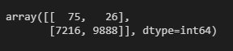
* **Imbalanced Classification Report:**

    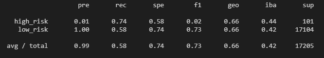

### 2. Details for SMOTE Oversampling
* **Balanced Accuracy Score:** 0.6537310478007576
* **Precision:** 0.01 for High Risk and 1.00 for Low Risk
* **Recall:** 0.62 for High Risk and 0.68 for Low Risk
* **f1 Score:** 0.02 for High Risk and 0.81 for Low Risk
* **Confusion Matrix:** 

    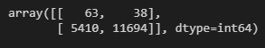
* **Imbalanced Classification Report:**

    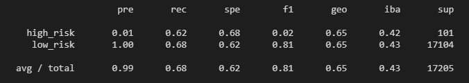

### 3. Details for ClusterCentroids Undersampling
* **Balanced Accuracy Score:** 0.5439153831192286
* **Precision:** 0.01 for High Risk and 1.00 for Low Risk
* **Recall:** 0.69 for High Risk and 0.39 for Low Risk
* **f1 Score:** 0.01 for High Risk and 0.57 for Low Risk
* **Confusion Matrix:** 

    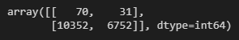
* **Imbalanced Classification Report:**

    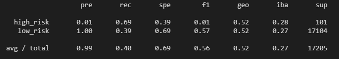

### 4. Details for SMOTEENN Combination Sampling
* **Balanced Accuracy Score:** 0.6808065277996462
* **Precision:** 0.01 for High Risk and 1.00 for Low Risk
* **Recall:** 0.77 for High Risk and 0.59 for Low Risk
* **f1 Score:** 0.02 for High Risk and 0.74 for Low Risk
* **Confusion Matrix:** 

    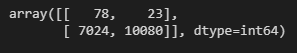
* **Imbalanced Classification Report:**

    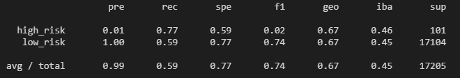

### 5. Details for Balanced Random Forest Classifier
* **Balanced Accuracy Score:** 0.7885466545953005
* **Precision:** 0.03 for High Risk and 1.00 for Low Risk
* **Recall:** 0.70 for High Risk and 0.87 for Low Risk
* **f1 Score:** 0.06 for High Risk and 0.93 for Low Risk
* **Confusion Matrix:** 

    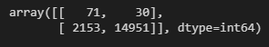
* **Imbalanced Classification Report:**

    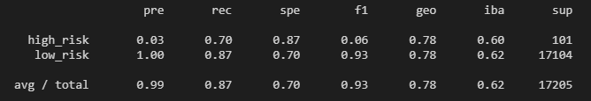

### 6. Details for Easy Ensemble AdaBoost Classifier
* **Balanced Accuracy Score:** 0.9316600714093861
* **Precision:** 0.09 for High Risk and 1.00 for Low Risk
* **Recall:** 0.92 for High Risk and 0.94 for Low Risk
* **f1 Score:** 0.16 for High Risk and 0.97 for Low Risk
* **Confusion Matrix:** 

    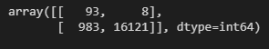
* **Imbalanced Classification Report:**

    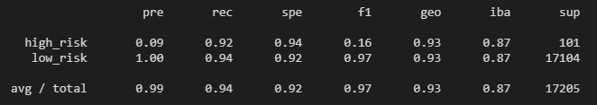