# Credit Risk Analysis

## Overview

FastLending, a peer-to-peer lending services company wants to use machine learning to predict credit risk. They believe using machine learning will result in a more quicker and reliable loan experience. Moreover, it will lead to more accurate prediction of good candidates for loans, leading to lower default rates. I am helping their lead data scientist in building and evaluating several machine learning models to predict credit risk. 

Since credit risk is an inherently unbalanced classification model, we are using using **imbalanced-learn** and **scikit-learn** libraries to build and evaluate models using resampling. Using credit card dataset from LendingClub, a peer-to-peer lending services company, we are:

1. Oversample the data using the **RandomOverSampler** and **SMOTE** algorithms
2. Undersample the data using the **ClusterCentroids** algorithm 
3. Use combinatorial approach of over- and undersampling using the **SMOTEENN** algorithm
4. Compare two new machine learning models that reduce bias. I.e.,  **BalancedRandomForestClassifier** and **EasyEnsembleClassifier**

**Data Source:** [LoanStats_2019Q1.csv](./Resources/LoanStats_2019Q1.csv)

**Libraries Used:** imbalanced-learn, scikit-learn

**Programming Languages:** Python 3.7.6

## Results

### 1. Details for RandomOversampler Oversampling
* **Balanced Accuracy Score:** 0.6603423204808787
* **Precision:** 0.01 for High Risk and 1.00 for Low Risk
* **Recall:** 0.74 for High Risk and 0.58 for Low Risk
* **F1 Score:** 0.02 for High Risk and 0.73 for Low Risk
* **Confusion Matrix:** 

    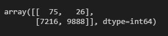
* **Imbalanced Classification Report:**

    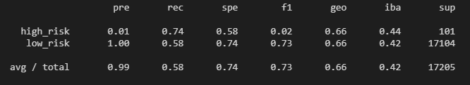

### 2. Details for SMOTE Oversampling
* **Balanced Accuracy Score:** 0.6537310478007576
* **Precision:** 0.01 for High Risk and 1.00 for Low Risk
* **Recall:** 0.62 for High Risk and 0.68 for Low Risk
* **F1 Score:** 0.02 for High Risk and 0.81 for Low Risk
* **Confusion Matrix:** 

    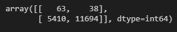
* **Imbalanced Classification Report:**

    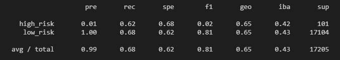
* The Balanced Accuracy Score is almost same as previous model. The Recall value for High Risk has dropped, but increased for Low Risk.

### 3. Details for ClusterCentroids Undersampling
* **Balanced Accuracy Score:** 0.5439153831192286
* **Precision:** 0.01 for High Risk and 1.00 for Low Risk
* **Recall:** 0.69 for High Risk and 0.39 for Low Risk
* **F1 Score:** 0.01 for High Risk and 0.57 for Low Risk
* **Confusion Matrix:** 

    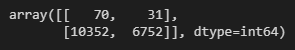
* **Imbalanced Classification Report:**

    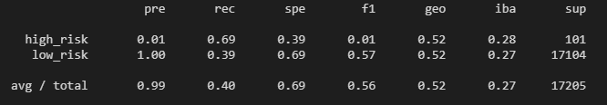
* The Balanced Accuracy Score is less than previous two oversampling model. The Recall value for Low Risk is also considerably low.

### 4. Details for SMOTEENN Combination Sampling
* **Balanced Accuracy Score:** 0.6808065277996462
* **Precision:** 0.01 for High Risk and 1.00 for Low Risk
* **Recall:** 0.77 for High Risk and 0.59 for Low Risk
* **F1 Score:** 0.02 for High Risk and 0.74 for Low Risk
* **Confusion Matrix:** 

    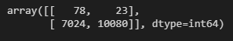
* **Imbalanced Classification Report:**

    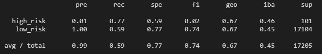
* The Balanced Accuracy Score is better than all previous resampling models. The Recall value for High Risk has also improved.

### 5. Details for Balanced Random Forest Classifier
* **Balanced Accuracy Score:** 0.7885466545953005
* **Precision:** 0.03 for High Risk and 1.00 for Low Risk
* **Recall:** 0.70 for High Risk and 0.87 for Low Risk
* **F1 Score:** 0.06 for High Risk and 0.93 for Low Risk
* **Confusion Matrix:** 

    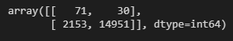
* **Imbalanced Classification Report:**

    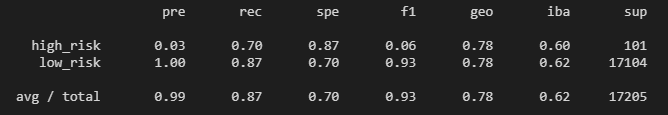
* The Balanced Accuracy Score is better than all previous resampling models. The Recall value for High Risk is good but highest for Low Risk as compared to previous models.

### 6. Details for Easy Ensemble AdaBoost Classifier
* **Balanced Accuracy Score:** 0.9316600714093861
* **Precision:** 0.09 for High Risk and 1.00 for Low Risk
* **Recall:** 0.92 for High Risk and 0.94 for Low Risk
* **F1 Score:** 0.16 for High Risk and 0.97 for Low Risk
* **Confusion Matrix:** 

    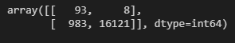
* **Imbalanced Classification Report:**

    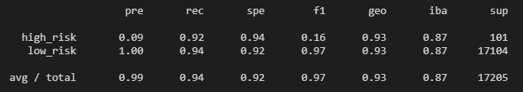
* This model is considerably bette than others in terms of Balanced Accuracy Score, Recall for High Risk and Low Risk, and F1 Score for Low Risk.

## Summary

* The Precision value for Low Risk is 1.00 for all the models
* The Balanced Accuracy Score for Random Oversampling and SMOTE models are almost the same. 
* The Balanced Accuracy Score was lower for ClusterCentroids Undersampling. However, it was slighty higher for SMOTEENN Combination Sampling as compared to previous two oversampling models .
* The Balanced Accuracy Scores for Balanced Random Forest and Easy Ensemble AdaBoost Classifier models are better than four resampling models.
* SMOTE model has lowest, and Combination for highest Recall value for High Risk out of four resampling methods.
* The ensemble methods have better Recall values than resampling methods for both High Risk and Low Risk.

### Recommeded Method

I would recommend **Easy Ensemble AdaBoost Classifier** for predictinig the credit risk in this case because it has a high Balanced Accuracy Score of 0.9316600714093861. Also, it has high Recall values. I.e., 0.92 for High Risk and 0.94 for Low Risk.
